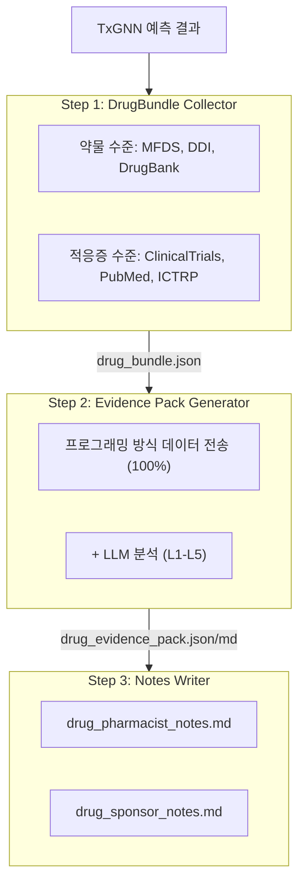
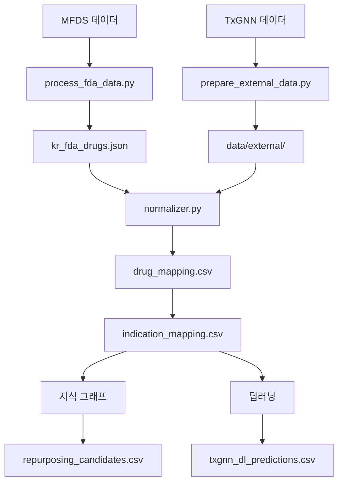

# KrTxGNN - South Korea: Drug Repurposing Predictions

[](https://krtxgnn.yao.care)
[](https://opensource.org/licenses/MIT)

South Korea MFDS 승인 약물에 대한 TxGNN 모델 기반 약물 재창출 예측.

## 면책 조항

- 본 프로젝트의 결과는 연구 목적으로만 제공되며 의료 조언을 구성하지 않습니다.
- 약물 재창출 후보는 적용 전에 임상 검증이 필요합니다.

## 프로젝트 개요

### 보고서 통계

| 항목 | 수량 |
|------|------|
| **약물 보고서** | 533 |
| **총 예측 수** | 38,275,274 |
| **고유 약물 수** | 1,166 |
| **고유 적응증 수** | 17,041 |
| **DDI 데이터** | 302,516 |
| **DFI 데이터** | 857 |
| **DHI 데이터** | 35 |
| **DDSI 데이터** | 8,359 |
| **FHIR 리소스** | 533 MK / 3,894 CUD |

### 근거 수준 분포

| 근거 수준 | 보고서 수 | 설명 |
|---------|-------|------|
| **L1** | 0 | 다수의 Phase 3 RCT |
| **L2** | 0 | 단일 RCT 또는 다수의 Phase 2 |
| **L3** | 0 | 관찰 연구 |
| **L4** | 0 | 전임상 / 기전 연구 |
| **L5** | 533 | 컴퓨터 예측만 |

### 소스별

| 소스 | 예측 수 |
|------|------|
| DL | 38,271,380 |
| KG + DL | 3,387 |
| KG | 507 |

### 신뢰도별

| 신뢰도 | 예측 수 |
|------|------|
| very_high | 2,509 |
| high | 1,458,984 |
| medium | 2,937,550 |
| low | 33,876,231 |

---

## 예측 방법

| 방법 | 속도 | 정확도 | 요구사항 |
|------|------|--------|----------|
| 지식 그래프 | 빠름 (초 단위) | 낮음 | 특별한 요구사항 없음 |
| 딥러닝 | 느림 (시간 단위) | 높음 | Conda + PyTorch + DGL |

### 지식 그래프 방법

```bash
uv run python scripts/run_kg_prediction.py
```

| 지표 | 값 |
|------|------|
| MFDS 총 약물 수 | 35,349 |
| DrugBank 매핑됨 | 22,294 (63.1%) |
| 재창출 후보 | 3,894 |

### 딥러닝 방법

```bash
conda activate txgnn
PYTHONPATH=src python -m krtxgnn.predict.txgnn_model
```

| 지표 | 값 |
|------|------|
| DL 총 예측 수 | 2,421,767 |
| 고유 약물 수 | 1,166 |
| 고유 적응증 수 | 17,041 |

### 점수 해석

TxGNN 점수는 약물-질병 쌍에 대한 모델의 신뢰도를 나타내며, 범위는 0에서 1입니다.

| 임계값 | 의미 |
|-----|------|
| >= 0.9 | 매우 높은 신뢰도 |
| >= 0.7 | 높은 신뢰도 |
| >= 0.5 | 중간 신뢰도 |

#### 점수 분포

| 임계값 | 의미 |
|-----|------|
| ≥ 0.9999 | 매우 높은 신뢰도, 모델의 가장 확신하는 예측 |
| ≥ 0.99 | 매우 높은 신뢰도, 검증 우선순위 지정 가치 있음 |
| ≥ 0.9 | 높은 신뢰도 |
| ≥ 0.5 | 중간 신뢰도 (시그모이드 결정 경계) |

#### 근거 수준 정의

| 수준 | 정의 | 임상적 의의 |
|-----|------|---------|
| L1 | 3상 RCT 또는 체계적 문헌고찰 | 임상 사용을 지지할 수 있음 |
| L2 | 2상 RCT | 사용을 고려할 수 있음 |
| L3 | 1상 또는 관찰 연구 | 추가 평가 필요 |
| L4 | 증례 보고 또는 전임상 연구 | 아직 권장되지 않음 |
| L5 | 계산 예측만, 임상 근거 없음 | 추가 연구 필요 |

#### 중요 참고사항

1. **높은 점수가 임상 효능을 보장하지 않습니다: TxGNN 점수는 지식 그래프 기반 예측으로 임상시험 검증이 필요합니다.**
2. **낮은 점수가 비효과적임을 의미하지 않습니다: 모델이 특정 연관성을 학습하지 못했을 수 있습니다.**
3. **검증 파이프라인과 함께 사용을 권장합니다: 본 프로젝트의 도구를 사용하여 임상시험, 문헌 및 기타 근거를 검토하세요.**

### 검증 파이프라인



---

## 빠른 시작

### 단계 1: 데이터 다운로드

| 파일 | 다운로드 |
|------|------|
| MFDS 데이터 | 데이터 소스 |
| node.csv | [Harvard Dataverse](https://dataverse.harvard.edu/api/access/datafile/7144482) |
| kg.csv | [Harvard Dataverse](https://dataverse.harvard.edu/api/access/datafile/7144484) |
| edges.csv | [Harvard Dataverse](https://dataverse.harvard.edu/api/access/datafile/7144483) |
| model_ckpt.zip | [Google Drive](https://drive.google.com/uc?id=1fxTFkjo2jvmz9k6vesDbCeucQjGRojLj) |

### 단계 2: 의존성 설치

```bash
uv sync
```

### 단계 3: 약물 데이터 처리

```bash
uv run python scripts/process_fda_data.py
```

### 단계 4: 어휘 데이터 준비

```bash
uv run python scripts/prepare_external_data.py
```

### 단계 5: 지식 그래프 예측 실행

```bash
uv run python scripts/run_kg_prediction.py
```

### 단계 6: 딥러닝 환경 설정

```bash
conda create -n txgnn python=3.11 -y
conda activate txgnn
pip install torch==2.2.2 torchvision==0.17.2
pip install dgl==1.1.3
pip install git+https://github.com/mims-harvard/TxGNN.git
pip install pandas tqdm pyyaml pydantic ogb
```

### 단계 7: 딥러닝 예측 실행

```bash
conda activate txgnn
PYTHONPATH=src python -m krtxgnn.predict.txgnn_model
```

---

## 리소스

### TxGNN 코어

- [TxGNN Paper](https://www.nature.com/articles/s41591-024-03233-x) - Nature Medicine, 2024
- [TxGNN GitHub](https://github.com/mims-harvard/TxGNN)
- [TxGNN Explorer](http://txgnn.org)

### 데이터 소스

| 카테고리 | 데이터 | 소스 | 참고 |
|------|------|------|------|
| **약물 데이터** | MFDS | - | South Korea |
| **지식 그래프** | TxGNN KG | [Harvard Dataverse](https://dataverse.harvard.edu/dataset.xhtml?persistentId=doi:10.7910/DVN/IXA7BM) | 17,080 diseases, 7,957 drugs |
| **약물 데이터베이스** | DrugBank | [DrugBank](https://go.drugbank.com/) | 약물 성분 매핑 |
| **약물 상호작용** | DDInter 2.0 | [DDInter](https://ddinter2.scbdd.com/) | DDI 쌍 |
| **약물 상호작용** | Guide to PHARMACOLOGY | [IUPHAR/BPS](https://www.guidetopharmacology.org/) | 승인 약물 상호작용 |
| **임상 시험** | ClinicalTrials.gov | [CT.gov API v2](https://clinicaltrials.gov/data-api/api) | 임상 시험 등록 |
| **임상 시험** | WHO ICTRP | [ICTRP API](https://apps.who.int/trialsearch/api/v1/search) | 국제 임상 시험 플랫폼 |
| **문헌** | PubMed | [NCBI E-utilities](https://eutils.ncbi.nlm.nih.gov/entrez/eutils/) | 의학 문헌 검색 |
| **이름 매핑** | RxNorm | [RxNav API](https://rxnav.nlm.nih.gov/REST) | 약물명 표준화 브릿지 |
| **이름 매핑** | PubChem | [PUG-REST API](https://pubchem.ncbi.nlm.nih.gov/docs/pug-rest) | 화학 물질 동의어 조회 |
| **이름 매핑** | ChEMBL | [ChEMBL API](https://www.ebi.ac.uk/chembl/api/data) | 생물활성 데이터베이스 |
| **표준** | FHIR R4 | [HL7 FHIR](http://hl7.org/fhir/) | MedicationKnowledge, ClinicalUseDefinition |
| **표준** | SMART on FHIR | [SMART Health IT](https://smarthealthit.org/) | EHR 통합, OAuth 2.0 + PKCE |

### 모델 다운로드

| 파일 | 다운로드 | 참고 |
|------|------|------|
| 사전 훈련 모델 | [Google Drive](https://drive.google.com/uc?id=1fxTFkjo2jvmz9k6vesDbCeucQjGRojLj) | model_ckpt.zip |
| node.csv | [Harvard Dataverse](https://dataverse.harvard.edu/api/access/datafile/7144482) | 노드 데이터 |
| kg.csv | [Harvard Dataverse](https://dataverse.harvard.edu/api/access/datafile/7144484) | 지식 그래프 데이터 |
| edges.csv | [Harvard Dataverse](https://dataverse.harvard.edu/api/access/datafile/7144483) | 엣지 데이터 (DL) |

## 프로젝트 소개

### 디렉토리 구조

```
KrTxGNN/
├── README.md
├── CLAUDE.md
├── pyproject.toml
│
├── config/
│   └── fields.yaml
│
├── data/
│   ├── kg.csv
│   ├── node.csv
│   ├── edges.csv
│   ├── raw/
│   ├── external/
│   ├── processed/
│   │   ├── drug_mapping.csv
│   │   ├── repurposing_candidates.csv
│   │   ├── txgnn_dl_predictions.csv.gz
│   │   └── integration_stats.json
│   ├── bundles/
│   └── collected/
│
├── src/krtxgnn/
│   ├── data/
│   │   └── loader.py
│   ├── mapping/
│   │   ├── normalizer.py
│   │   ├── drugbank_mapper.py
│   │   └── disease_mapper.py
│   ├── predict/
│   │   ├── repurposing.py
│   │   └── txgnn_model.py
│   ├── collectors/
│   └── paths.py
│
├── scripts/
│   ├── process_fda_data.py
│   ├── prepare_external_data.py
│   ├── run_kg_prediction.py
│   └── integrate_predictions.py
│
├── docs/
│   ├── _drugs/
│   ├── fhir/
│   │   ├── MedicationKnowledge/
│   │   └── ClinicalUseDefinition/
│   └── smart/
│
├── model_ckpt/
└── tests/
```

**범례**: 🔵 프로젝트 개발 | 🟢 로컬 데이터 | 🟡 TxGNN 데이터 | 🟠 검증 파이프라인

### 데이터 흐름



---

## 인용

이 데이터세트 또는 소프트웨어를 사용하는 경우 다음을 인용해 주세요:

```bibtex
@software{krtxgnn2026,
  author       = {Yao.Care},
  title        = {KrTxGNN: Drug Repurposing Validation Reports for South Korea MFDS Drugs},
  year         = 2026,
  publisher    = {GitHub},
  url          = {https://github.com/yao-care/KrTxGNN}
}
```

TxGNN 원본 논문도 인용해 주세요:

```bibtex
@article{huang2023txgnn,
  title={A foundation model for clinician-centered drug repurposing},
  author={Huang, Kexin and Chandak, Payal and Wang, Qianwen and Haber, Shreyas and Zitnik, Marinka},
  journal={Nature Medicine},
  year={2023},
  doi={10.1038/s41591-023-02233-x}
}
```
